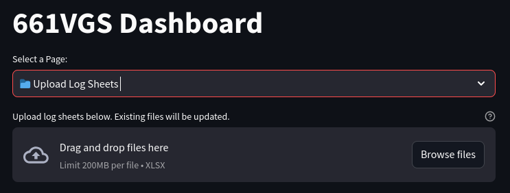

# Log Keeper

661 VGS - All-in-one log keeper for the Viking fleet. Records launches from 2965D log sheets, uploads to MongoDB Atlas, and provides a web interface for viewing statistics.


## Contents

1. [Installation](#installation)
1. [Usage](#usage)
1. [Contribution](#contribution)
1. [Testing](#testing)
1. [Support](#support)
1. [License](#license)

## Installation

1. Sync your squadron sharepoint using OneDrive:

    

1. Create a directory on your sharepoint to store the log sheets e.g. `Log Sheets`.

1. Save the `2965D_YYMMDD_ZEXXX.xlsx` template (See `docs/`) into the `Log Sheets` directory.

    

1. Get started with creating some log sheets to test it out. Note, you will need to update the hidden `INPUT_DATA` sheet to add your aircraft and pilots:

    

1. Sign up to [MongoDB Atlas](https://cloud.mongodb.com). Contact the project owner for access to the database.

## Usage

### Normal Usage

1. Login to the dashboard:

    

1. Upload your completed log sheets. Note, the re-uploading log sheets will overwrite the existing data:

    

## Python Dashboard

1. The log keeper comes with a python dashboard for viewing statistics. To run the dashboard, setup the secrets. NOTE, you must have a MongoDB Atlas account and access to the database (get this from the project owner).:

    ```bash
    echo "MONGO_URI=<YOUR_MONGO_URI>" > .streamlit/secrets.toml
    ```

1. run the following command:

    ```bash
    viking-dashboard
    ```

    

## Contribution

- Ensure [Python 3.11](https://www.python.org/downloads/windows/) is installed and `python.exe` is [added to the path](https://realpython.com/add-python-to-path/):


- [Issue Tracker](https://github.com/mjennings061/viking-log-keeper/issues)

- [Link to Source Code](https://github.com/mjennings061/viking-log-keeper/tree/main)

### Testing

To run the tests, run the following commands:

```bash
playwright install
python -m pytest
```

## Support

For questions and assistance, consider raising an issue on the [issue tracker](https://github.com/mjennings061/viking-log-keeper/issues). All other queries can be directed to [mjennings061@gmail.com](mjennings061@gmail.com)

## License

The project is licensed under the MIT License.
